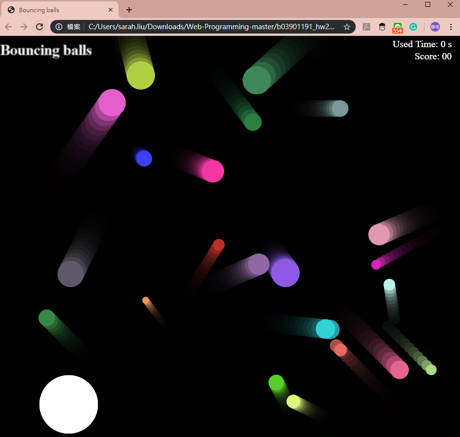
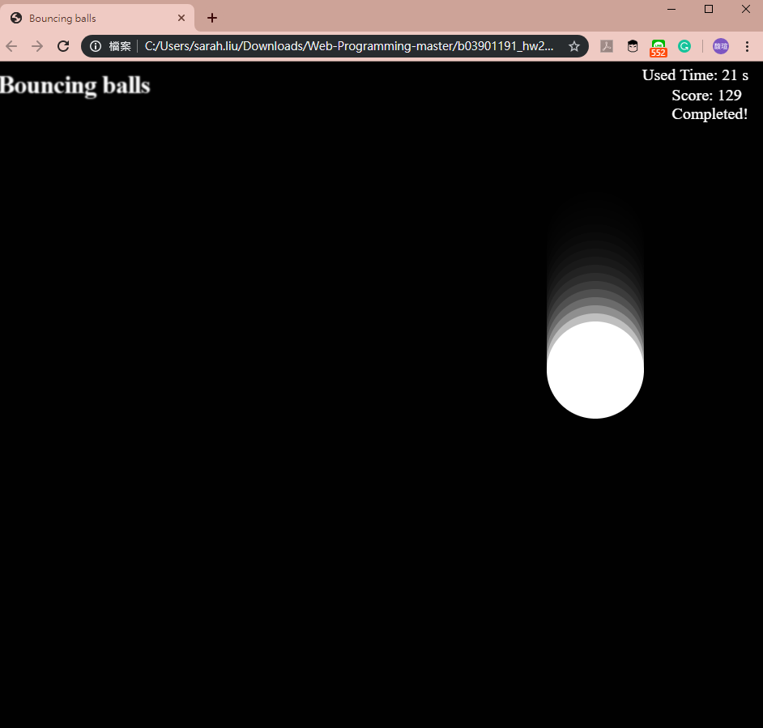

# Bouncing balls
### 2018, March, Class Web Programming asignments HW2-1

* Based on Mozilla web game practice.
* Goal: Move the big white ball by keyboard and eat all the other little boucing balls.
* eat one ball get 5pt, every second -1pt. The score is presented on the topright.

## How to play
* Just open the .html file

## A Quick Glance of Bouncing Balls
You are the big white ball, now press the arrows to move!

After eating all little balls...

